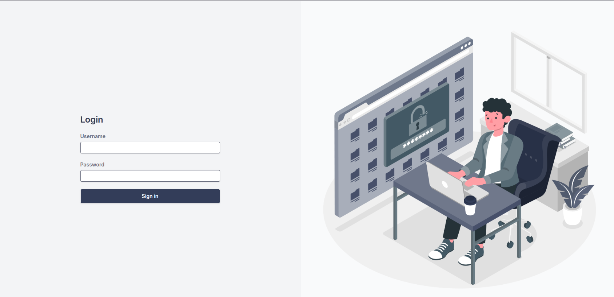

# Vehicle Management Built in Django + Vue JS Rest API integrated. 

### Kebutuhan
1. Git
2. Docker (28.1.1 or supported version)
3. Node (v22.14.0 or supported version)
4. Python (3.9+ or supported version)

### Langkah Install
1. `git clone https://github.com/fajardwntara/vehicles-management.git` untuk clone repository
2. `docker compose up --build` untuk membangun semua dependencies yang dibutuhkan.
3. `docker compose exec backend python manage.py makemigrations` pada root folder untuk melakukan pengecekan perubahan pada model database.
4. `docker compose exec backend python manage.py migrate` pada root folder untuk melakukan migrasi model database
5. `docker compose exec backend python manage.py createsuperuser` pada root folder untuk melakukan pembuatan superuser (Admin) untuk langkah awal dalam login
6. Pergi ke `http://localhost:5173` untuk menjalankan frontend (Vue JS) aplikasi dalam melakukan aktivitas dari sisi pengguna.
7. Pergi ke `http://localhost:8000` untuk menjalankan backend (Django REST Framework) dalam melakukan manajemen API. Berikut link download pada API Management (Postman Collection): `https://drive.google.com/file/d/1r0V1HPcr9ERvsBAFIHu-Mexsdt-2E_aY/view?usp=sharing`

### Catatan
Apabila memiliki kendala dalam melakukan build pada docker lakukan penghapusan image dan lakukan build ulang.

`docker compose build --no-cache`

### Deskripsi Pengunaan

#### Manajemen Kendaraan

- Terdapat 2 pilihan jenis kendaraan, yaitu:
  - **Mobil (Cars)**
  - **Motor (Motorcycles)**
- Pada pembuatan data kendaraan baru, inisialisasi stok secara default adalah **0**.
- Untuk menambah stok, diperlukan melakukan **Transaksi Pembelian** melalui menu **Purchase**.

#### Transaksi Sale & Purchase

- Terdapat 3 status transaksi, yaitu:
  - **DRAFT**
  - **CONFIRM**
  - **CANCEL**

- **Data dapat diubah atau dihapus hanya jika statusnya masih `DRAFT`.**

- Status **`CONFIRM`** menandakan transaksi selesai:
  - Pada **Purchase (Pembelian)**, stok kendaraan yang dipilih akan bertambah.
  - Pada **Sale (Penjualan)**, stok akan berkurang (stok wajib lebih dari 0 agar transaksi valid).

- Status **`CANCEL`** dapat diterapkan pada transaksi yang berstatus **`CONFIRM`**, yang berarti membatalkan transaksi tersebut dan:
  - Mengembalikan stok kendaraan ke kondisi sebelum transaksi.
  - Mengembalikan jumlah transaksi keuangan terkait.

### Screenshoots

